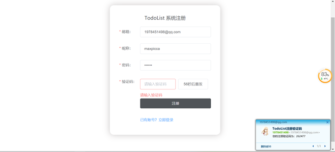
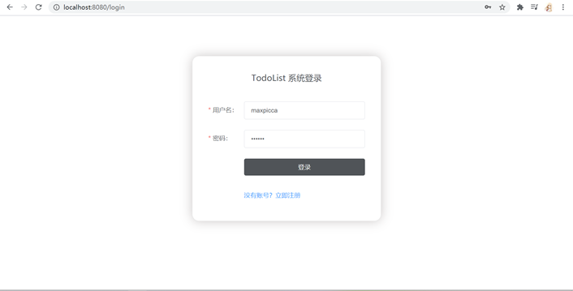
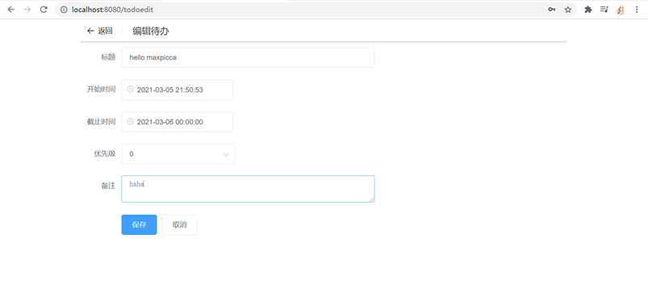
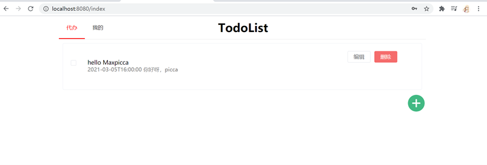
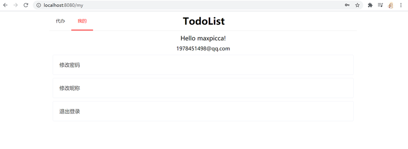

## README

> **todolist网页设计开发**，源于一个自学小组的开发项目，从2021年02月开始，历时三周完成，初次学习springboot，开发中尚且有诸多不足，如有疑问，issue见。
>
> README现下内容于2021年03月初写成。
>
> 该仓库于2022年2月24日开始重新整理，之后会不定时更新，完善项目的过程中，完善自己的技术栈。

## 一、技术说明

- 后端采用：springboot

- 前端采用：vue.js

- 数据库：MySQL  增删改查：Mybatis-plus

## 二、页面说明

1、用户登录注册功能，且邮箱注册时发送验证码

注册页面：

登录页面：

2、普通用户：添加任务，查看任务相关情况，修改任务完成情况，

添加任务页面：

任务呈现页面：

3、个人主页及其相关设置

## 三、项目优缺点

### 1、优点：

1. 页面简洁美观

2. 对一些可能的异常情况都进行了处理，程序具有一定的稳健性

### 2、缺点和尚未完成的功能：

1. 任务定时邮箱通知 
   思路一是前端设置，定时向后端发起任务通知请求，这种做法，如果用户不登陆，便无法完成通知；
   思路二是每添加一个任务开启定时线程，但是不知道time和cron如何转换，且这种做法会导致未登录的用户也在占用线程；
   思路三是此处需调用Web API，将定时任务储存到定时任务管理服务器上（此处已开发，仅会需调用API即可）（没有认真读文档，这会儿才看到调api这回事）
2. todo中未完成图片和附件的上传。
   最开始开发todoedit页面时，便想着设置，但本着先把简单的开发出来后添加这块的思想，导致后来拖着时间来不及开发了。
3. 项目最开始开发的时候没有考虑到shiro安全架构，所以用户密码、用户id没有进行加密操作（深知这对用户非常不负责任，是非常不对的！！！但项目起步未想到这一步，为了赶进度也没有再重构，呜呜呜~ T_T），用户信息并未用后端token保存到session会话中，只进行了前端token保存（localStorage），很容易导致信息泄露
4. 数据校验也只是用的前端的validator校验，从发起请求到后端输入数据库这一路，都没有添加校验，这样搞容易翻车
5. 项目未进行docker部署，尚未绑定域名并在云服务器上部署（docker尝试过，没有成功）